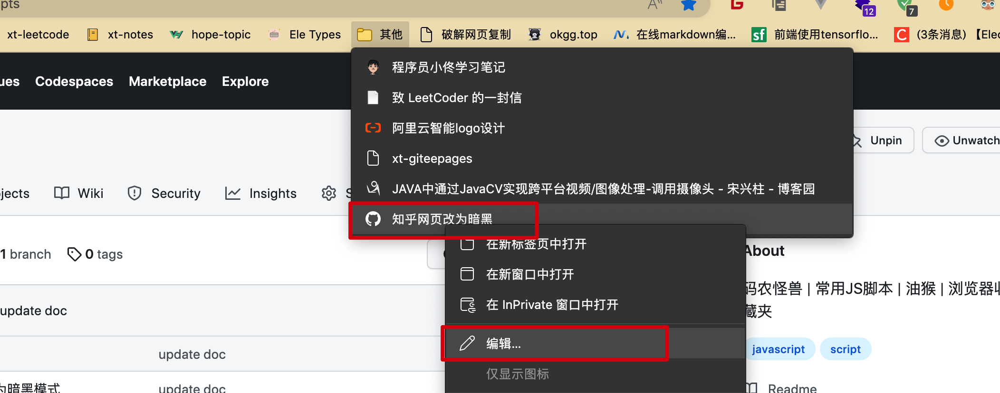

# 常用JS脚本

## 仓库说明

本仓库收集了一些工作学习中常用的`JS`脚本，可以添加到浏览器收藏夹或者可以将其作为脚本添加到油猴插件中。

## 脚本使用

每一个功能脚本一般提供两个文件

1、第一个是浏览器收藏夹脚本，即`browser_like_script.js`

2、第二个是油猴插件脚本，即`tamper_monkey_script.js`

>两者区别：
>
>1、浏览器收藏夹脚本需要进入特定网站之后，点击一下才会执行，不会自动匹配网址执行，刷新后无效。
>
>2、油猴插件脚本可以编写匹配规则，进入特定网站之后，自动执行脚本，不需要每次点击，即使刷新之后，同样的网址也会自动执行脚本，即刷新亦有效。

### 浏览器收藏脚本使用步骤

1、随便收藏一个网址到浏览器收藏夹中，修改脚本名称和位置，然后点击完成。

2、在浏览器收藏栏选择刚刚收藏的网页，右键选择编辑。

3、将`URL`修改为本仓库中对应功能脚本的`browser_like_script.js`文件中的内容。

4、重新刷新网页，并且点击一下该收藏地址即可执行该脚本，达到修改网页的功能。

### 油猴插件脚本使用步骤

1、浏览器安装油猴插件，在浏览器扩展中选择该插件，点击添加新脚本。

2、将脚本修改为本仓库中对应功能脚本的`tamper_monkey_script.js`文件中的内容。

3、`Command+S`点击保存即可，脚本会自动匹配相应的网址，如果匹配成功，会自动执行，如果想要取消该功能，直接关闭插件中的该脚本即可。

## 请喝可乐

觉得有帮助的小伙伴，欢迎请作者喝杯肥宅快乐水！

## 关注怪兽

码农怪兽，一只喜欢研究技术、科技、思想、软件、资源、产品的非不正经的UP主！如果有任何问题可以关注怪兽的微信公众号及时留言反馈！

